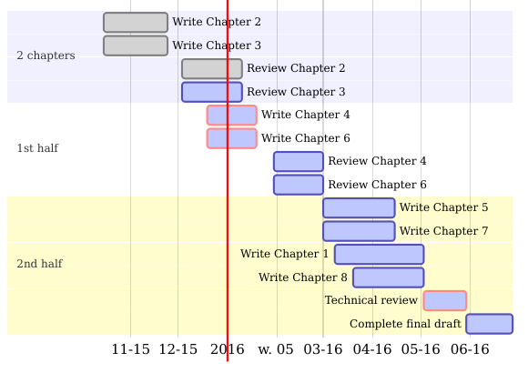

```{r setup, include=FALSE}
knitr::opts_chunk$set(echo = FALSE, fig.width = 10, fig.height = 5.5)

library(ggplot2)
library(dplyr)
library(reshape2)
```

## Plan prezentacji

1. Co to jest Preludium?
2. Ocena grantów w konkursie Preludium.
3. Pisanie grantów.

## Preludium 14

Projekty badawcze realizowane przez osoby rozpoczynające karierę naukową nieposiadające stopnia naukowego doktora.

## Dlaczego pisać granty?

 - Dodatkowe fundusze na badania,
 - dodatkowe wynagrodzenie,
 - łatwiejsza obrona.

## Dlaczego pisanie grantu nie zabiera dużo czasu?

Doktorat wymaga zrealizowania projektu badawczego, którego część może być finansowana przez Preludium.

## Wynagrodzenia

"Uważamy, że zapewnienie wynagrodzenia dla doktoranta jest obowiązkiem jego promotora, który odpowiednie środki finansowe powinien zapewnić w ramach własnego grantu."

Wynagrodzenie dodatkowe (nie wyklucza innych wynagrodzeń/stypendiów finansowanych przez NCN) do 1500 zł/miesięcznie.

## Panele NCN

Każdy grant NCN składa się do 25 paneli dziedzinowych, które należą do trzech głownych grup panel:

 - HS – Nauki Humanistyczne, Społeczne i o Sztuce,
 - NZ – Nauki o Życiu,
 - ST – Nauki Ścisłe i Techniczne.

## Panele NCN

 - Kierownik projektu wybiera panel samodzielnie. 

 - Skierowanie wniosku do niewłaściwego panelu może zaważyć na ocenie, a nawet skutkować odrzuceniem wniosku przez Zespół Ekspertów.

 - Składanego wniosku nie można kierować do dwóch paneli jednocześnie. Po złożeniu wniosku nie można go przenosić między panelami.
 
## ST1 (Nauki matematyczne)

 - Logika i podstawy matematyki
 - Algebra
 - Teoria liczb
 - Geometria algebraiczna i zespolona
 - Geometria
 - Topologia
 - Grupy Liego i algebry Liego
 - Analiza
 - Algebry operatorowe i analiza funkcjonalna
 - Równania różniczkowe zwyczajne i układy dynamiczne

## ST1 (Nauki matematyczne)

 - Równania różniczkowe cząstkowe
 - Fizyka matematyczna
 - Rachunek prawdopodobieństwa i statystyka matematyczna
 - Kombinatoryka
 - Matematyczne aspekty informatyki
 - Analiza numeryczna i obliczenia naukowe
 - Teoria sterowania i optymalizacja
 - Zastosowania matematyki w innych naukach
 - Inne zagadnienia pokrewne

## ST6 (Informatyka i technologie informacyjne)

 - Architektura systemów komputerowych, przetwarzanie wszechobecne
 - Systemy komputerowe, systemy równoległe i rozproszone, sieci sensorów, systemy wbudowane, systemy cybernetyczne
 - Systemy programowania, systemy operacyjne, metody rozwoju oprogramowania, języki programowania
 - Metody formalne, teoretyczne podstawy informatyki w tym informatyka teoretyczna
 - Kryptologia, prywatność i bezpieczeństwo, informatyka kwantowa
 - Algorytmika, algorytmy równoległe, rozproszone i sieciowe, algorytmiczna teoria gier
 - Sztuczna inteligencja, systemy inteligentne i wieloagentowe

## ST6 (Informatyka i technologie informacyjne)

 - Grafika komputerowa, przetwarzanie obrazów, wizualizacja komputerowa, multimedia, gry komputerowe
 - Interakcja człowiek – komputer, rozpoznawanie i synteza mowy, przetwarzanie języka naturalnego
 - Technologie i systemy informatyczne, bazy danych, technologie internetowe w tym wyszukiwanie informacji i biblioteki cyfrowe
 - Uczenie maszynowe, statystyczne przetwarzanie danych i zastosowanie w przetwarzaniu sygnałów
 - Obliczenia naukowe, narzędzia modelowania i symulacji
 - Bioinformatyka, bioobliczenia, obliczenia DNA i molekularne
 - Inne zagadnienia pokrewne

## Ocena wniosków

Ocena wniosków jest dwuetapowa.

Tylko wnioski odrzucone w drugim etapie mogą być ponownie złożone. 

## Skuteczność wniosków

```{r}
dat <- read.csv("results.csv") %>% 
  mutate(gr = substr(panel, 0, 2),
         panel_id = sapply(panel, function(i) substr(as.character(i), 3, nchar(as.character(i)))),
         panel_id = as.numeric(panel_id),
         panel_id = factor(panel_id, levels = sort(unique(panel_id))))


filter(dat, panel %in% c("ST1", "ST6")) %>% 
  select(ed, panel, st2, zl, fin) %>% 
  mutate(ed = factor(ed)) %>% 
  mutate(success = fin/zl) %>% 
  melt(measure.vars = c("fin", "st2", "zl")) %>% 
  mutate(success = ifelse(variable == "zl", formatC(success, 2), ""),
         variable = factor(variable, labels = c("Finansowany", "Odrzucony (drugi etap)", "Złożony")),
         variable = factor(variable, levels = rev(levels(variable)))) %>%
  ggplot(aes(x = as.factor(ed), y = value, fill = variable)) +
  geom_col(position = "dodge") +
  geom_text(aes(label = success), vjust = 0.1) +
  facet_wrap(~ panel) +
  scale_fill_discrete("") +
  scale_y_continuous("Liczba wniosków") +
  scale_x_discrete("Edycja") +
  theme_bw(base_size = 15) +
  theme(legend.position = "bottom",
        legend.direction = "horizontal")
```

## Ocena merytoryczna wniosków

1. Ocena formalna.
1. Ocena przez ekspertów z panelu.
2. Ocena przez recenzentów.

## Ocena przez ekspertów z panelu

Dwoje członków Zespołu Ekspertów ocenia wnioski indywidualnie. Na tym etapie oceniany jest **formularz** oraz **skrócony opis projektu badawczego**. Oceny są uzgadniane podczas pierwszego posiedzenia Zespołu Ekspertów.

## Ocena przez recenzentów

Eksperci zewnętrzni (czyli spoza Zespołu Ekspertów) oceniają indywidualnie **formularz** oraz **szczegółowy opis projektu badawczego**. 

## Opisy projektu

Limity stron uwzględniają literaturę.

 - Streszczenie: 1 strona A4, po polsku i angielsku.
 - Skrócony opis: do 5 stron A4, tylko po polsku.
 - Szczegółowy opis: do 10 stron A4, tylko po angielsku.
 - Streszczenie popularnonaukowe: 1 str A4

Dodatkowo uzasadnienie badań podstawowych (do 2500 znaków).

## Struktura opisów

1. Cel naukowy projektu.
2. Znaczenie projektu.
3. Koncepcja i plan badań.
4. Metodyka badań.
5. Literatura przedmiotu.

## Cel naukowy projektu

Problem jaki wnioskodawca podejmuje się rozwiązać, zakładane hipotezy badawcze oraz spodziewany efekt końcowy.

## Dotychczasowy stan wiedzy

 - Uzasadnienie podjęcia problemu badawczego
 - Uzasadnienie nowatorskiego charakteru badań
 - Znaczenie wyników projektu dla rozwoju danej dziedziny i dyscypliny naukowej

## Znaczenie projektu

 - Dotychczasowy stan wiedzy. 
 - Uzasadnienie podjęcia problemu badawczego.
 - Uzasadnienie nowatorskiego charakteru badań.
 - Znaczenie wyników projektu dla rozwoju danej dziedziny i dyscypliny naukowej oraz rozwoju cywilizacyjnego.


## Koncepcja i plan badań
 
 - Ogólny plan badań, 
 - szczegółowe cele badawcze, 
 - wyniki badań wstępnych, 
 - analiza ryzyk.

## Metodyka badań

 - Sposób realizacji badań, 
 - metody, techniki i narzędzia badawcze, 
 - metody analizy i opracowania wyników, 
 - urządzenia i aparatura wykorzystywane w badaniach.

## Metodyka badań

Harmonogram Adamieckiego (diagram Gantta)



## Uzasadnienie badań podstawowych

Nie więcej niż 2,5 tys. znaków ze spacjami, język angielski.

Badania podstawowe: oryginalne prace badawcze
eksperymentalne lub teoretyczne podejmowane przede
wszystkim w celu zdobywania nowej wiedzy o podstawach
zjawisk i obserwowalnych faktów bez nastawienia na
bezpośrednie praktyczne zastosowanie lub użytkowanie (za art. 2 pkt 3 ustawy z 30.04.2010 r. o zasadach
finansowania nauki).

## Ocena wniosków

```{r}
dat <- read.csv("ocena.csv")

ggplot(dat, aes(x = 1, y = value, fill = category)) +
  geom_col() +
  coord_flip() +
  theme_void() +
  guides(fill = guide_legend(title = "", ncol = 2)) +
  theme(legend.position = "bottom",
        legend.direction = "vertical",
        axis.ticks.x = element_line(color = "black"),
        axis.text.x = element_text(color = "black", angle = 0, debug = FALSE)) +
  #scale_y_continuous(breaks = cumsum(rev(dat[["value"]]))) +
  scale_y_continuous(breaks = c(60L, 75L, 80L, 90L, 100L))
```


## Zasady oceniania

Czy wniosek został przygotowany rzetelnie?

- tak
- nie

## Zasady oceniania

Czy projekt ma charakter naukowy?

- tak
- nie

## Zasady oceniania

Czy projekt spełnia kryterium badań podstawowych?

- tak
- nie

## Zasady oceniania

Czy projekt spełnia inne wymagania przedstawione w ogłoszeniu o konkursie?

- tak
- nie

## Ocena poziomu naukowego badań - 60%

 - 5: Doskonały, po zakończeniu wyniki projektu mogą zostać opublikowane w wydawnictwach
/czasopismach rangi światowej, znajdujących się na liście Journal Citation Reports (JCR).
 - 4: Bardzo dobry, po zakończeniu wyniki projektu mają szansę na publikację w wydawnictwach
/czasopismach głównego nurtu dla danej dziedziny, z których część znajduje się na liście Journal
Citation Reports (JCR).
 - 3: Dobry, po zakończeniu wyniki projektu mogą zostać opublikowane w wydawnictwach/czasopismach
specjalistycznych.
 - 2: Przeciętny, po zakończeniu wyniki projektu mogą zostać opublikowane w wydawnictwach/czasopismach o zasięgu lokalnym.

## Ocena poziomu naukowego badań (60%)

 - 1: Słaby, małe szanse na publikację wyników.
 - 0: Bardzo słaby.

## Ocena nowatorskiego charakteru projektu (15%)

Charakter projektu:

 - 3: Projekt nowatorski.
 - 1: Projekt zawierający elementy nowatorskie.
 - 0: Projekt pozbawiony elementów nowatorskich.
 
Wpływ realizacji projektu badawczego na rozwój dyscypliny naukowej:

 - 3: Projekt o dużym wpływie na rozwój dyscypliny naukowej.
 - 1: Projekt o umiarkowanym wpływie na rozwój dyscypliny naukowej.
 - 0: Projekt bez wpływu na rozwój dyscypliny naukowej/skierowany do niewłaściwego panelu.
 
## Ocena dorobku kierownika projektu (10%)

Osiągnięcia naukowe kierownika projektu w tym publikacje w renomowanych wydawnictwach/czasopismach naukowych:

 - 5: Kierownik projektu posiada wyróżniający dorobek naukowy.
 - 4: Kierownik projektu posiada bardzo dobry dorobek naukowy.
 - 3: Kierownik projektu posiada dobry dorobek naukowy.
 - 2: Kierownik projektu posiada słaby dorobek naukowy.
 - 1: Brak dorobku naukowego kierownika projektu.
 
## Ocena dorobku opiekuna naukowego (10%)

 - 5: Dorobek opiekuna naukowego wybitny: m.in. należy do czołówki światowej w swojej dziedzinie,
współpracuje z najlepszymi naukowcami z innych ośrodków lub jest przez nich cytowany, publikuje w
najlepszych wydawnictwach/czasopismach znajdujących się na liście Journal Citation Reports (JCR), jego prace są bardzo wysoko
cytowane (zgodnie z bazą Web of ScienceTM Core Collection), jest zapraszany do najlepszych ośrodków naukowych i na najważniejsze
kongresy/konferencje w swojej dziedzinie.

## Ocena dorobku opiekuna naukowego (10%)

 - 4: Dorobek opiekuna naukowego bardzo dobry: m.in. jest międzynarodowo uznanym ekspertem w
swojej dziedzinie, współpracuje z bardzo dobrymi naukowcami z innych ośrodków, publikuje w bardzo
dobrych wydawnictwach/czasopismach znajdujących się na liście Journal Citation Reports (JCR), jego prace są wysoko cytowane (zgodnie z
bazą Web of ScienceTM Core Collection),
jest zapraszany do bardzo dobrych ośrodków naukowych i na ważne kongresy /konferencje w swojej
dziedzinie.

## Ocena dorobku opiekuna naukowego (10%)

 - 3: Dorobek opiekuna naukowego dobry: m.in. jest rozpoznawany międzynarodowo w swojej dziedzinie,
współpracuje z dobrymi naukowcami z innych ośrodków, publikuje w dobrych wydawnictwach
/czasopismach, w tym również w czasopismach znajdujących się na liście Journal Citation Reports (JCR), jego prace są średnio cytowane (zgodnie z bazą Web of ScienceTM Core Collection).

## Ocena dorobku opiekuna naukowego (10%)

 - 2: Dorobek opiekuna naukowego przeciętny: m.in. jest rozpoznawany w kraju w swojej dziedzinie, nikła
współpraca naukowa z innymi ośrodkami, publikacje w wydawnictwach /czasopismach o zasięgu
ogólnokrajowym, niska cytowalność prac (zgodnie z bazą Web of ScienceTM Core Collection, w
przypadku HS, tam gdzie istnieją odpowiednie bazy danych).
 - 1: Dorobek opiekuna naukowego słaby: m.in. brak rozpoznawalności w dziedzinie, brak współpracy
naukowej, publikacje w wydawnictwach /czasopismach o zasięgu lokalnym.
 - 0: Brak dorobku naukowego opiekuna naukowego.
 
## Ocena możliwości wykonania (5%)

Oena możliwości wykonania projektu, w tym kompetencje kierownika projektu, konstrukcja
zespołu badawczego, zaplecze badawcze, itp.:

 - 3: Bardzo dobra.
 - 2: Dobra.
 - 1: Słaba.
 - 0: Brak możliwości realizacji projektu.

## Prezentacja ocen wniosków grantowych

W załączniku.
