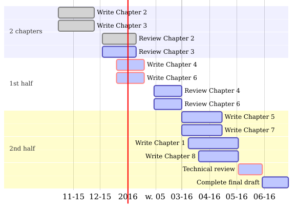

```{r setup, include=FALSE}
knitr::opts_chunk$set(echo = TRUE)
```

## Plan warsztatów

1. Kilka rad dotyczących pisania wniosków.
2. Pisanie polskiego streszczenia projektu (40 min).
3. Dyskusja o streszczeniach w podgrupach:
  - najczęstsze błędy we wnioskach,
  - najmocniejsze strony wniosków.

## Jak pisać opisy?

Priorytety: 

 - jasność i zwięzłość wywodu,
 - graficzne schematy,
 - odniesienia do wstępnych rezultatów/własnych prac dotyczących danej problematyki.

## Jak pisać opisy?

 - definiować nowe pojęcia i dbać o ich poprawność (zwłaszcza w przypadku polskiej wersji),
 - nie używać synonimów pojęć specjalistyczych,
 - pisać dla odbiorców, nie dla siebie (panel + dwaj recenzenci).

## Jak pisać opisy?

Efektywne zagospodarowania przestrzeni poprzez formatowanie tekstu. 

Ograniczenia:

 - Rozmiar strony - A4,
 - typ czcionki - Times New Roman,
 - wielkość czcionki - przynajmniej 11 pkt,
 - interlinia - pojedyncza, 
 - marginesy: boczne - 2 cm, dolne, górne - 1,5 cm.

## Metodyka badań

Harmonogram Adamieckiego (diagram Gantta)



## Jak pisać skrócony opis i streszczenia?

 - Prosty i przejrzysty język. Członkowie panelu nie muszą być specjalistami w dziedzinie, której dotyczy wniosek.
 - Skupić się na znaczeniu projektu.
 
## Jak pisać szczegółowy opis?

 - Wyczerpująco odwoływać się do literatury przedmiotu. Recenzenci zazwyczaj dobrze orientują się w tematyce projektu.
 - Skupić się na wstępnych rezultatach i metodologii.

## Jak czytać literaturę?

Software do zarządzania cytacjami (np. EndNote, Mendeley, Zotero).

 - szybkie dodawanie pozycji literaturowych do bazy,
 - własne annotacje znalezionego piśmiennictwa,
 - automatyzacja tworzenia bibliografii,
 - piśmiennictwo w chmurze.

## Jak czytać literaturę?

Dobre zarządzanie cytacjami ułatwia dostęp do już poznanej literatury, co przekłada się na efektywniejszą pracę.

## Jak myśleć o pisaniu grantów?

Grant, który nie zostanie złożony, nigdy nie będzie sfinansowany.

Na każdą akceptację przypada kilka odrzuceń.

Odrzucenie **nie** jest katastrofą.

## Zadanie

Napisać polskojęzyczne streszczenie Preludium (1 str A4).

## Struktura opisów

1. Cel naukowy projektu.
2. Znaczenie projektu.
3. Koncepcja i plan badań.
4. Metodyka badań.
5. Literatura przedmiotu.
